# Map Resource Legend

Adds new skills named Mining, Research, Farming. Difficulty classes are averaged out. They can change depending on the situation.

|Name | Type | Image | DC for PCs|
|-----|------|-------|-----------|
|Weave Line|Artifact|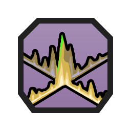|DC20 Constitution to Use|
|Shipwreck|Artifact|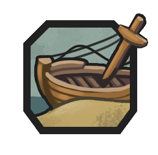|-|
|Antique|Artifact|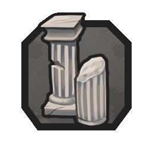|DC20 History|
|Bananas|Common|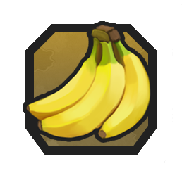|DC12 Farming|
|Cattle|Common|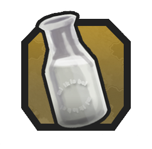|DC12 Survival|
|Copper|Common|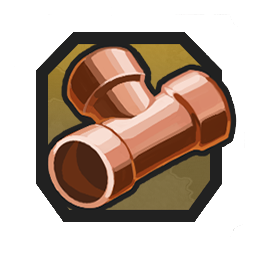|-|
|Crabs|Common|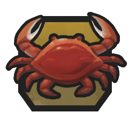|DC12 Animal Handling|
|Deer|Common|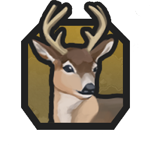|DC12 Animal Handling|
|Fish|Common|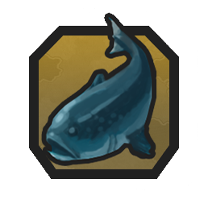|DC12 Animal Handling|
|Red Corn|Common|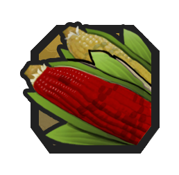|DC12 Farming|
|Rice|Common|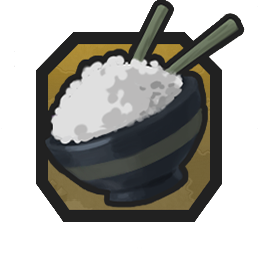|DC12 Farming|
|Sheep|Common|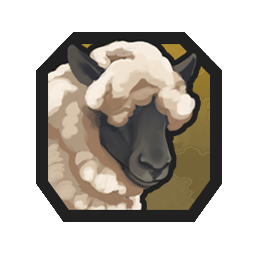|DC12 Animal Handling|
|Wheat|Common|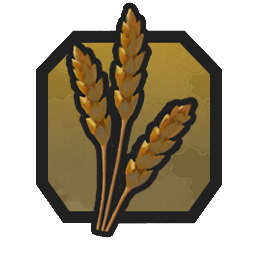|DC12 Farming|
|Stone|Common|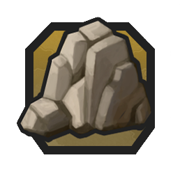|DC12 Mining|
|Aluminum|Strategic|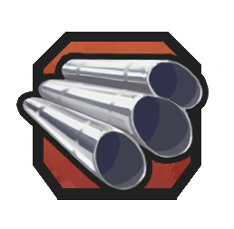|-|
|Coal|Strategic|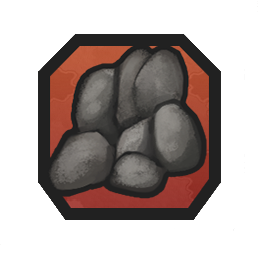|DC10 Mining|
|Horses|Strategic|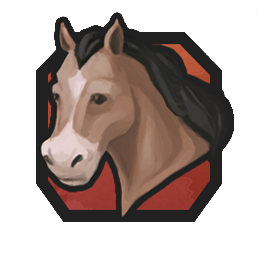|DC16 Animal Handling|
|Iron|Strategic|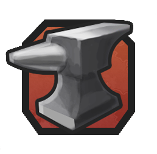|-|
|Amber|Luxury|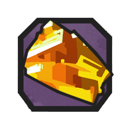|DC24 Mining|
|Cinnamon|Luxury||DC24 Farming|
|Citrus|Luxury|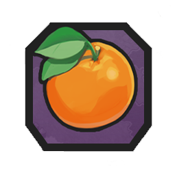|DC24 Farming|
|Cloves|Luxury|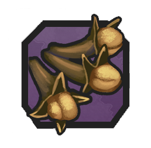|DC30 Farming|
|Cocoa|Luxury|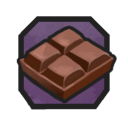|DC30 Farming|
|Coffee|Luxury|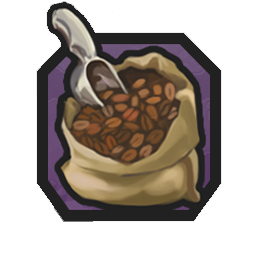|DC36 Farming|
|Cosmetics|Luxury|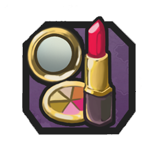|DC24 Arcana|
|Cotton|Luxury|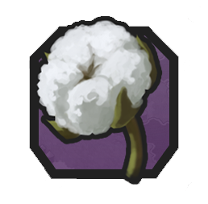|DC24 Farming|
|Diamonds|Luxury|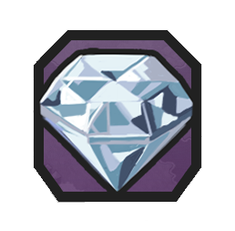|DC36 Mining|
|Dyes|Luxury||DC18 Religion|
|Furs|Luxury|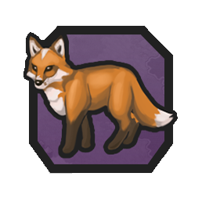|DC24 Animal Handling|
|Gold Ore|Luxury|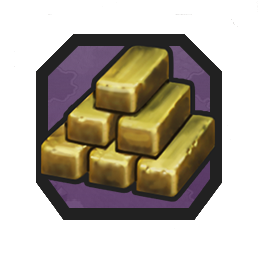|DC24 Mining|
|Honey|Luxury|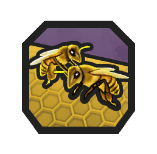|DC26 Animal Handling|
|Incense|Luxury|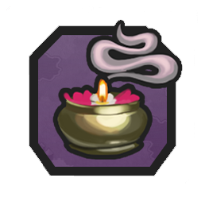|DC14 Research|
|Ivory|Luxury||DC24 Animal Handling|
|Jeans|Luxury|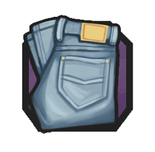|DC16 Research|
|Marble|Luxury|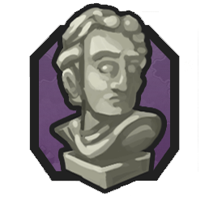|DC30 Mining|
|Olives|Luxury|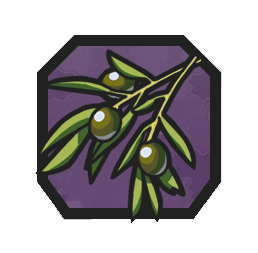|DC22 Nature|
|Pearls|Luxury|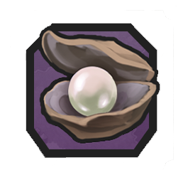|DC20 Research|
|Perfume|Luxury|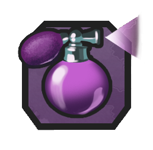|DC26 Research|
|Salt|Luxury|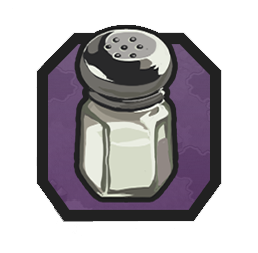|DC12 Nature|
|Silk|Luxury|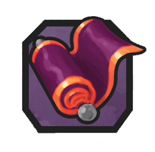|DC26 Research|
|Silver|Luxury|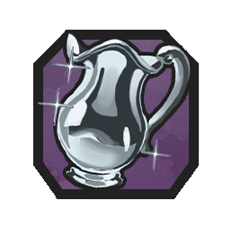|DC24 Mining|
|Spices|Luxury|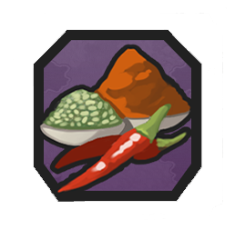|DC16 Research|
|Sugar|Luxury|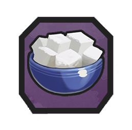|DC16 Research|
|Tea|Luxury|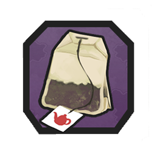|DC12 Research|
|Tobacco|Luxury|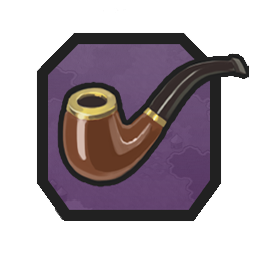|DC20 Research|
|Toys|Luxury|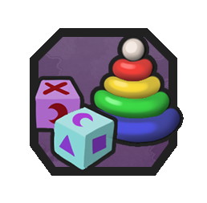|DC18 Research|
|Truffles|Luxury|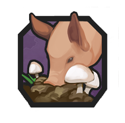|DC26 Research|
|Turtles|Luxury|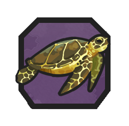|DC24 Animal Handling|
|Whales|Luxury|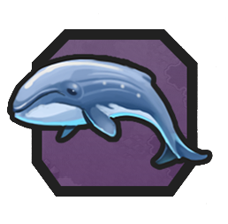|DC36 Animal Handling|
|Wine|Luxury|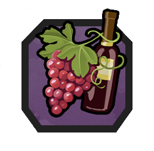|DC16 Survival|
|Runes|Unique|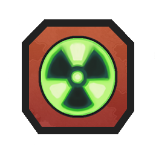|DC30 Intelligence|
|Hexed|Unique|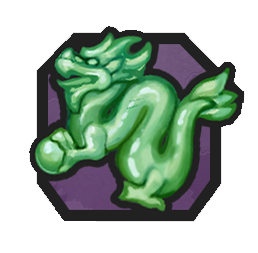|-|
|Frostforge Steel|Unique|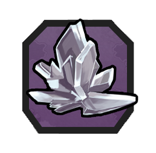|-|
|Skyforge Metal|Unique||DC25 Arcana|
|Demonic|Unique||-|
|Phosite|Unique||-|

All images are taken from CIV6 website.
